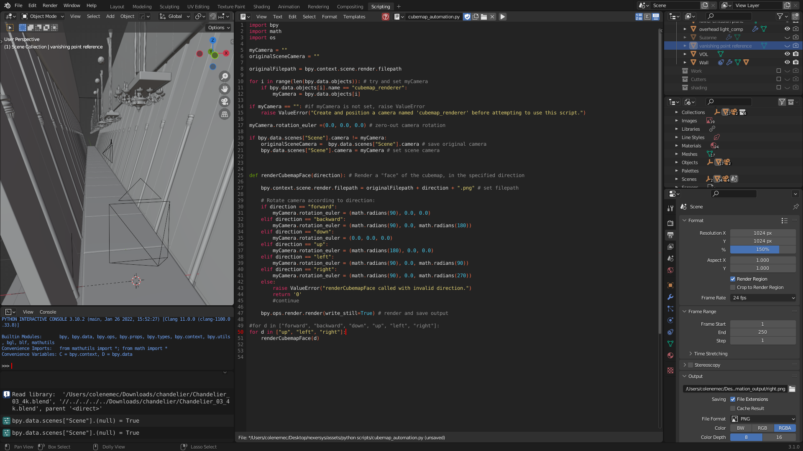
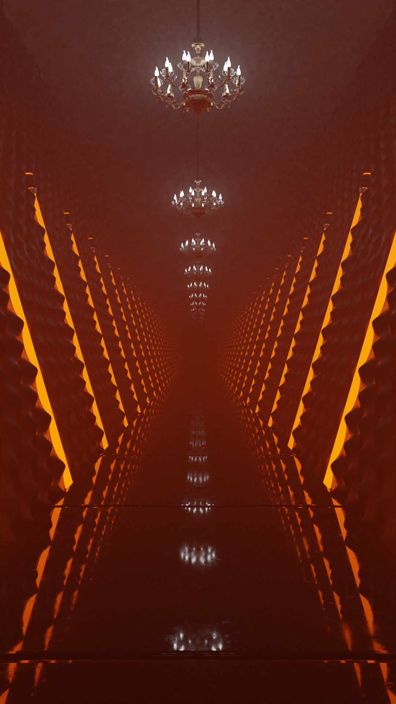
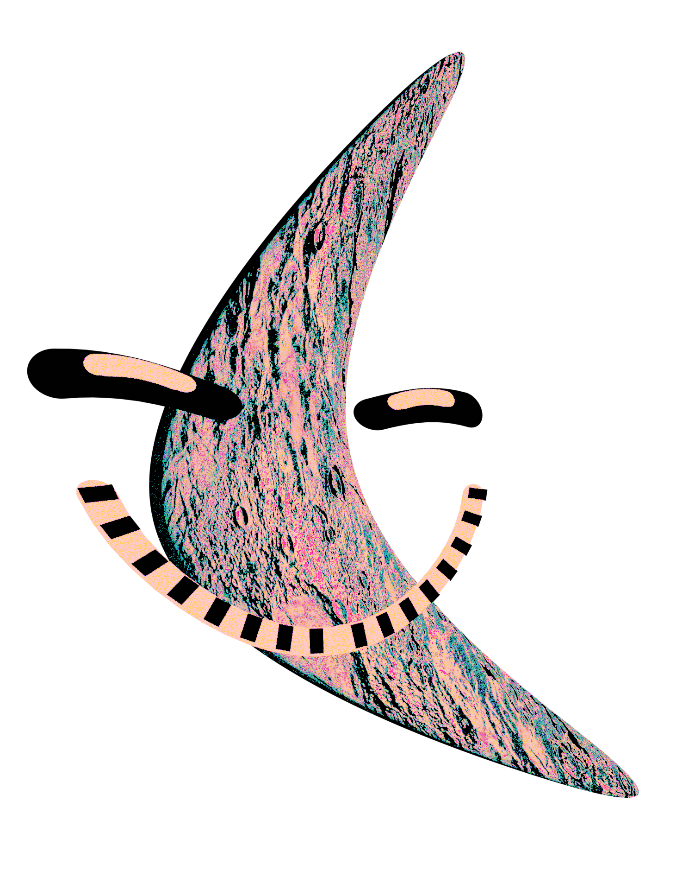
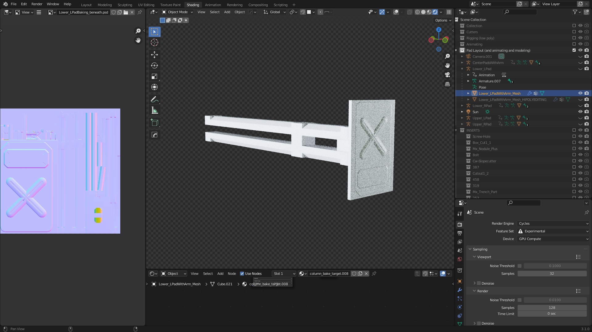
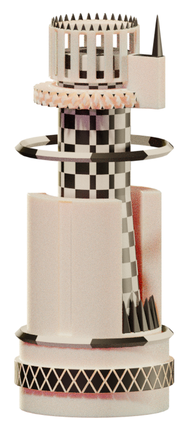
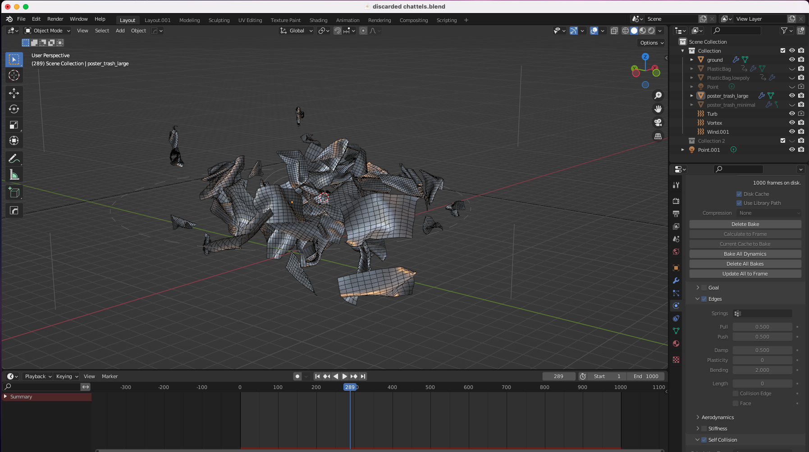
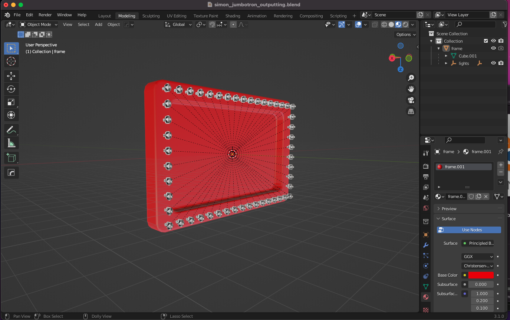

# README
This repository is home to a few additional things which, I think, potential employers/coworkers/buddies could be interested in, and which aren't yet displayed elsewhere. The programming here is less professional than my typical work, as it was done to quickly extend the functionality of the software I use, so other repositories on my GitHub may be a more accurate representation of my true output.

## /tools/
There are three Python scripts here which are examples of the casual tools I create as part of my visual art worflow. Many of them have very simple but specific uses, and were created in an hour or less as the need arose. A description of each follows...

### batch_render_general.py
This was created for rendering sprites of the 3D art I created for *Dreams of Digital Demise Act I: Atyxia*, a small video game which I primarily worked on during a month of my senior year of high school (the repository which I used for this project is publicly available on my GitHub profile [here](https://github.com/deeptronos/atyxia)). It was created inside Blender, my 3D software of choice, so it probably won't be useful (or usable) outside of a Blender context.\
It is used to render an animated 3D asset from several angles around the asset, so that interactive 3D-style rotation can be animated in-game to give the appearence of a more complex asset while retaining the advantages of a sprite-based 2D engine.\
It outputs into a specified directory a folder for each angle, with each folder containing all the frames of animation. E.g., if I wanted to render 24 angles of a 600 frame animation into the folder ```walkcycle```, I'd be left with 24 directories underneath ```walkcycle```, each containing 600 individual frames.

### Rendering_Angle_Folder-spritesheet_generator.py
Designed in conjunction with the above script, this was made to create spritesheets from directories of animations which I'd rendered from Blender. The game engine I worked in preferred spritesheets for animation, and so I wanted to automate the process of turning animation frames into a functional spritesheet. \
```parent_dir``` must be specified in the script for any given use. It can be run with Python3 and requires the Python Image Library Easily the worst-named script here.

### cubemap_automation.py 
This was created during my software engineering internship at Nexersys. As a member of an extremely small team (and the only one who knew how to use Blender) I had to do visual design for the prototype mini-game projects I was assigned to complete, and so this is a small automation tool from that process (however this is not a typical demonstration of the software engineering I did during that time).\
Like many 3D game engines, Unity can use cubemaps to achieve easy approximations of reflections. Designing for hardware that was extremely resource-limited meant that they were essential.\
This script was employed in a Blender scene I'd created to capture stills from for use as the prototype's background, as I wanted the dynamic 3D assets placed in front of that background to be grounded in the space. It uses a wide-angle Blender camera placed in the scene to output up to 6 images of the environment, for use in Unity's built-in cubemap system.

## /img/
This directory contains some images which demonstrate my 3D art work and worflow. The majority of these screenshots are from my time at Nexersys, including several mockup renders for minigame visual direction and screenshots of my process, but there are a couple of assets from my personal video game project, as well. For simplicity, I've included all the images from ```/img/``` below:

















\
If you made it this far, thank you for reading! ^^
